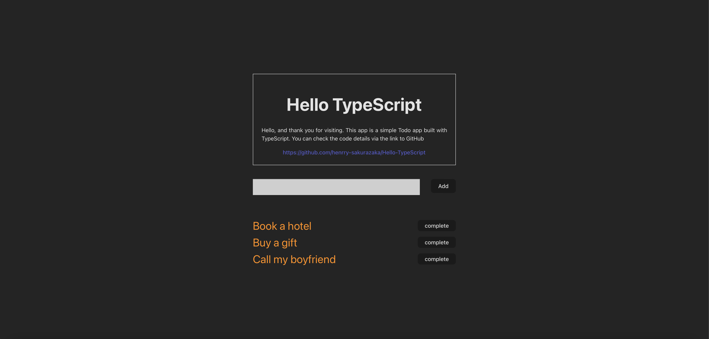

# Hello-TypeScript

簡易的なTodoアプリをTypeScriptで作成してみました。

# React + TypeScript + Vite

> 公開中: https://hello-typescript-8a1d9.web.app

## 🔍 概要

Reactライブラリを使用し、ユーザーのタスク管理を支援するToDoアプリを作成しました。
あくまでTypeScriptの学習のための成果物だったので学習に集中するため、データベース、インフラ、サーバーは制作しませんでした。これらのバックエンドの実装、実践はReminderリポジトリの方で実装してますので、そちらをご参照ください。

> Reminder: https://github.com/henrry-sakurazaka/Reminder

## 🛠️ 使用技術

| 種別           | 技術スタック   | 選定理由                                                          |
| -------------- | -------------- | ----------------------------------------------------------------- | --- |
| フレームワーク | React / Vite   | コンポーネント指向で開発しやすく、Viteにより高速な開発体験を実現  |     |
| ビルドツール   | Vite           | 高速なビルドとHMR（Hot Module Replacement）による効率的な開発環境 |
| Linter         | ESLint         | コードの一貫性とバグの早期発見を促進するため                      |
| フォーマッター | Prettier       | チームでのフォーマット統一とコードレビュー効率化のため            |
| CI/CD          | GitHub Actions | GitHubと統合しやすく、テスト・デプロイ自動化の導入が容易なため    |

- スクリーンショットやGIF（UI紹介）



This template provides a minimal setup to get React working in Vite with HMR and some ESLint rules.

Currently, two official plugins are available:

- [@vitejs/plugin-react](https://github.com/vitejs/vite-plugin-react/blob/main/packages/plugin-react/README.md) uses [Babel](https://babeljs.io/) for Fast Refresh
- [@vitejs/plugin-react-swc](https://github.com/vitejs/vite-plugin-react-swc) uses [SWC](https://swc.rs/) for Fast Refresh

## Expanding the ESLint configuration

If you are developing a production application, we recommend updating the configuration to enable type aware lint rules:

- Configure the top-level `parserOptions` property like this:

```js
export default tseslint.config({
  languageOptions: {
    // other options...
    parserOptions: {
      project: ['./tsconfig.node.json', './tsconfig.app.json'],
      tsconfigRootDir: import.meta.dirname,
    },
  },
});
```

- Replace `tseslint.configs.recommended` to `tseslint.configs.recommendedTypeChecked` or `tseslint.configs.strictTypeChecked`
- Optionally add `...tseslint.configs.stylisticTypeChecked`
- Install [eslint-plugin-react](https://github.com/jsx-eslint/eslint-plugin-react) and update the config:

```js
// eslint.config.js
import react from 'eslint-plugin-react';

export default tseslint.config({
  // Set the react version
  settings: { react: { version: '18.3' } },
  plugins: {
    // Add the react plugin
    react,
  },
  rules: {
    // other rules...
    // Enable its recommended rules
    ...react.configs.recommended.rules,
    ...react.configs['jsx-runtime'].rules,
  },
});
```

> > > > > > > f7cc70a (Initial commit)
